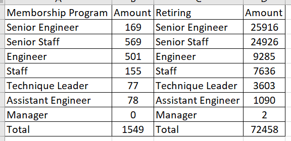
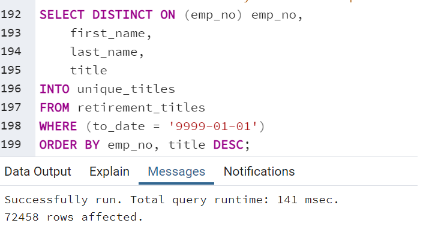
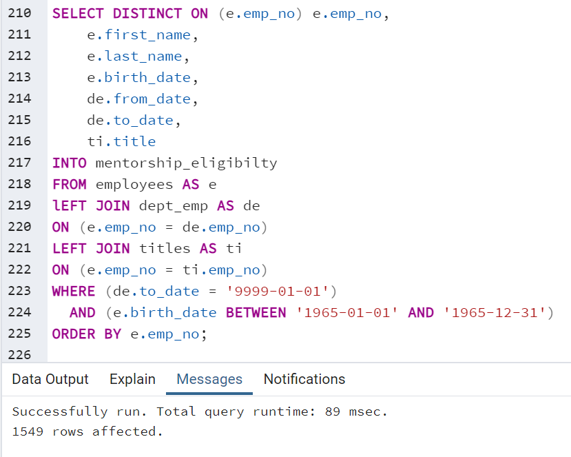

# Pewlett-Hackard-AnalysisBS
## Overview of the analysis
We are to determine the number of retiring employees per title and identify employees who are eligible to participate in a mentorship program. 

## Results:
- Based off our collection of data, we foresee 72,458 employees looking to retire. 
- The mentorship program has room to fill 1,549 of those positions.
- This a big concern with having to fill the other 70,909 positions.
- Immediate action must be taken on evaluation of each of these jobs for replacement or termination of certain positions. This graph below breaks down each positions' count.  

 

## Summary:
How many roles will need to be filled as the "silver tsunami" begins to make an impact?

- There will be 72,458 positions needing filled.  
 
Are there enough qualified, retirement-ready employees in the departments to mentor the next generation fo Pewlett Hackard employees?

- Yes, we have 72,458 retirement-ready employees. Within this group, there are a sufficient number of qualified mentors in the departments to train the next generation of 1,549 employees.  
 
